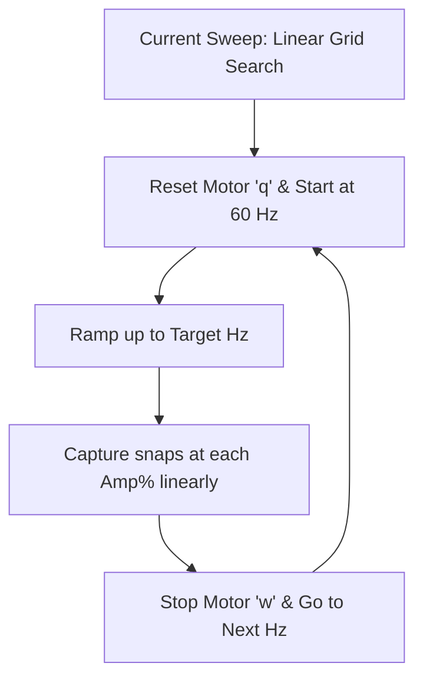
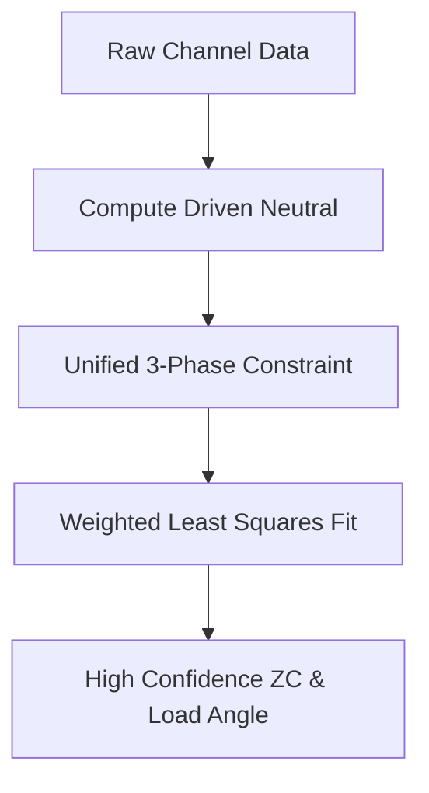

# MEMORANDUM

**TO:** Motor Control Development Team
**FROM:** AI Coding Assistant
**DATE:** June 21, 2026
**SUBJECT:** Next Levers for High-Confidence Open-Loop Observation & Sweep Optimization

---

## 1. Context & Objective

We have successfully validated a 3-harmonic reconstruction algorithm ($N=3$) that reconstructs the back-EMF (BEMF) zero-crossing (ZC) and load angle across a wide operating plane (320–800 Hz). The reconstruction is checkable against direct in-window crossings (ground truth) where they exist, showing a tight median residual of $5.7\%$.

However, two major bottlenecks exist in the current setup:
1. **Sweep Duration:** A full high-resolution sweep takes several hours due to the overhead of the serial interface, uniform grid execution, and repeated positioning ramps from rest.
2. **Phase A Sensing Anomaly:** PA4 (ADC2 ch17) exhibits a lower floating-window amplitude ($R_A \approx 0.5 \times R_{B,C}$) and a significant DC offset, introducing asymmetry and preventing in-window zero-crossings on Phase A.

To address these without modifying the hardware, this memo outlines the next software, firmware, and host-side analysis levers to pull.

---

## 2. Lever 1: Speeding Up the Sweep (From Hours to Minutes)

The current sweep collector in `scripts/scope_sweep.py` is slow because it performs a linear grid search and restarts the motor from 60 Hz on every frequency setpoint.

### Proposed Optimizations:

* **Direct Frequency-to-Frequency Ramping (Stateful Ramping):**
  Instead of killing the motor and starting from 60 Hz for every frequency:
  1. Keep the motor running.
  2. Transition from $f_1 \to f_2$ directly at a safe ramp rate (e.g., $67\text{ Hz/s}$) while holding the amplitude above the known stall curve.
  3. Only fall back to a `q` reset if a watchdog or stall event is detected.
  * *Estimated time saving:* Saves $\approx 2.5\text{ seconds}$ per frequency step (up to $80\%$ setup overhead reduction).

* **Boundary Bisection Search:**
  Instead of sweeping the entire amplitude range (e.g., 30% down to stall in 0.1% increments), search for the lock-to-stall transition boundary using binary search:
  1. Test the midpoint amplitude.
  2. If the rotor is locked, search lower; if stalled, search higher.
  3. Once the boundary is found, run a high-resolution narrow sweep only in a $\pm1.0\%$ range around the transition.
  * *Estimated time saving:* Reduces the number of amplitude steps per frequency from 100+ to under 15.

* **Adaptive Snapshot Sizing:**
  1. Take a single snapshot first.
  2. Classify the state. If it is in solid lock with high confidence (`plateau_spread` < 1%, `late_swing` high), record it immediately and move to the next setpoint.
  3. Only capture additional snaps (e.g., `--snaps 5`) if the first snapshot shows high variance, marginal lock, or is near a transition boundary.

---

## 3. Lever 2: Firmware-Side Signal Integrity Levers

### Dynamic ADC Sample-Time Scaling
The ADC sampling time is currently fixed at `Cycles_6_5` (153 ns) to fit in the narrow PWM ON-window at low duty cycles. However, the floating phase has high impedance compared to the driven phases. A 153 ns sample window can lead to charge contamination from the previous conversion channel in the scan sequence (memory effect).

* **Mechanism:**
  The firmware can dynamically modify the sample time register (`SMPR`) based on the current commanded amplitude:
  $$\text{At low duty (<10%): } \text{Use Cycles\_6\_5 (153 ns) to avoid window overflow}$$
  $$\text{At high duty (>=10%): } \text{Scale to Cycles\_12\_5 or Cycles\_24\_5 for the BEMF channels}$$
  This allows the ADC internal sampling capacitor to fully settle, resolving potential cross-channel leakage without sacrificing low-duty safety.

### Automated At-Rest Ratiometric Calibration
To neutralize the Phase A PA4 attenuation:
1. Implement a startup routine in the firmware that drives each phase in turn with a low, safe static duty cycle while the motor is at rest.
2. Record the ADC readings on all three channels.
3. Compute and store ratiometric scaling/offset factors:
   $$V'_A = g_A \cdot V_A + o_A$$
4. Apply these correction factors directly in the firmware prior to transmitting data, or send them as metadata to the host.

---

## 4. Lever 3: Host-Side Analysis & Fitting Levers

### Unified 3-Phase Constrained Fit
Currently, `zc_fit.py` fits each phase's coefficients independently. At high frequencies, the number of samples per sector drops significantly (e.g., only 4 samples/sector at 800 Hz), making independent fits highly susceptible to noise.

* **Mechanism:**
  Constrain the optimizer so that all three phases share a single rotor angle $\theta$ and a common wave shape, offset by $120^\circ$ electrical:
  $$V_A(\theta) = f(\theta)$$
  $$V_B(\theta) = f\left(\theta - \frac{2\pi}{3}\right)$$
  $$V_C(\theta) = f\left(\theta + \frac{2\pi}{3}\right)$$
  This reduces the fitting parameters by a factor of 3 and enforces physical consistency, dramatically improving noise immunity and ZC confidence at high RPM.

### Weighted Least Squares (WLS) & Demagnetization Fitting
Instead of discarding post-commutation samples with a hard blanking threshold:
1. Use Weighted Least Squares, where the weight of each sample increases exponentially with time elapsed since the last commutation:
   $$W(t) = 1 - e^{-t/\tau}$$
2. Alternatively, fit the demagnetization decay directly in the regression model:
   $$V_{\text{float}} - V_{\text{neutral}} = d_0 e^{-t/\tau} + c_0 + \sum_{h=1}^{N} (a_h\cos(h\theta) + b_h\sin(h\theta))$$
   This enables the extraction of useful information from data points closer to the zero-crossing.

### Host-Side Phase A Scaling Factor
If firmware calibration is not desired, add a scaling parameter $g_A$ to the regression model on the host:
$$V_A(\theta) = g_A \cdot f(\theta)$$
By solving for $g_A$ during the fit, the host can dynamically normalize Phase A's attenuation.

---

## 5. Recommended Implementation Order

1. **Step 1 (Sweep Optimization):** Modify `scope_sweep.py` to implement stateful frequency ramping (eliminating `q`-resets) and adaptive snapshot sizing. This will immediately cut sweep times down from hours to minutes.
2. **Step 2 (Phase A Diagnostics):** Implement the host-side Phase A scaling parameter ($g_A$) in `zc_fit.py` to confirm whether software normalization resolves the structural divergence in the sector spread.
3. **Step 3 (Signal Quality):** Add dynamic ADC sample-time scaling in `examples/scope1.rs` to improve settling at higher duties.
4. **Step 4 (Advanced Fitting):** Implement the unified 3-phase constrained fit to secure high-frequency (600–1200 Hz) observation confidence.
